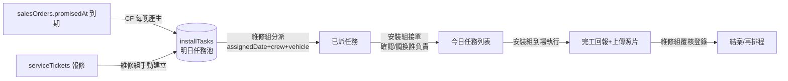

# 峻晟 ERP 擴充規劃 — 訂單／客戶／生產／派車／維修

> 目的：為串接會計作帳系統而重整訂單流程,並擴充生產、派車、維修管理。
> 現有 `Orders`(Google Sheet 同步)保留為「舊資料/查詢用」,新模組以 Firestore 為唯一真實來源(SoR)。

---

## 1. 業務流程 (End-to-End)

```mermaid
flowchart LR
  A[詢價/收水槽] --> Q0[獨立報價<br/>accn / QuotePanel]
  Q0 -->|保留貨源| Q0L[料已叫進<br/>價格快照鎖定]
  Q0L --> B[打板]
  A -->|未先報價| B
  B --> C[繪圖]
  C --> Q[計價<br/>比對舊報價?]
  Q -->|有舊報價| QL[沿用鎖定價格]
  Q -->|無舊報價| QN[現時計價]
  QL --> D{客戶確認回簽}
  QN --> D
  D -->|簽回| E[正式發單<br/>產生訂單號]
  E --> F[拆料單]
  F --> G[橋剪裁切]
  G --> H[水刀挖洞]
  H --> I[細部工序<br/>45°背切/成型/嵌水槽/套板]
  I --> J[驗收]
  J -->|不合格| H
  J -->|合格| K[派車安裝]
  K --> L[完工照片/簽收]
  L --> M[請款<br/>→ 會計系統]
  M -.保固期內.-> N[維修工單]
  N --> K
```



**生產三大關卡**:裁切 / 水刀 / 驗收(其餘細部工序視為水刀後續子工序)。

---

## 2. 模組劃分與優先順序

| #   | 模組         | 主要 Firestore Collection                       | 對應路由        | 階段              |
| --- | ------------ | ----------------------------------------------- | --------------- | ----------------- |
| 1   | **客戶管理** | `customers`                                     | `/customers`    | P1 — 其他模組基礎 |
| 2   | **訂單管理** | `salesOrders`(新)、`orderDrafts`(打板/繪圖階段) | `/sales-orders` | P1                |
| 2.5 | **計價模組** | `quotes`(頂層)、`priceMaster`                   | `/quote`、嵌入訂單頁 | P1.5 — 回簽前必須 |
| 3   | **生產管理** | `productionJobs`、`productionStages`            | `/production`   | P2                |
| 4   | **派車管理** | `installTasks`、`vehicles`(任務本位,見 §3.6;不另存 `dispatches`) | `/dispatch`     | P3                |
| 5   | **維修管理** | `serviceTickets`                                | `/service`      | P4                |

> 舊 `Orders`(Sheet 同步)保留唯讀,新模組以 `salesOrders` 為主檔。

---

## 3. 資料模型(草案)

### 3.1 `customers` — 客戶主檔

| 欄位                                | 型別      | 說明                                                           |
| ----------------------------------- | --------- | -------------------------------------------------------------- |
| `id`                                | doc id    | 自動編號 `C` + yymm + 流水號,例 `C2605001`                     |
| `shortCode`                         | string    | **客戶英文代號**(訂單號末段用,如 `ABC`);大寫英數,3~6 碼,系統內唯一 |
| `companyId`                         | string    | 對應 Users.companyId(客戶登入用)                               |
| `name`                              | string    | 公司/個人名稱                                                  |
| `taxId`                             | string    | 統編(會計用)                                                   |
| `contactPerson` / `phone` / `email` | string    | 聯絡資訊(主要聯絡人)                                           |
| `salesContacts[]`                   | array     | **客戶端常用業務員清單** `[{name, phone, email}]`,下單時下拉選 |
| `address`                           | string    | 寄送地址                                                       |
| `type`                              | enum      | `設計師` / `建商` / `直客` / `經銷`                            |
| `paymentTerms`                      | string    | 月結30/現金/分期                                               |
| `creditLimit`                       | number    | 信用額度(預留)                                                 |
| `notes`                             | string    |                                                                |
| `createdAt` / `updatedAt`           | timestamp |                                                                |
| `createdByUid` / `updatedByUid`     | string    | 稽核欄位                                                       |

### 3.2 `salesOrders` — 訂單主檔(唯一 collection,含建檔→結案全流程)

**流程說明:**  
辦公室建檔(`draft`) → 套表出空白生產確定單 → 繪圖完成 → 傳客戶確認(`pendingSign`) → **客戶回簽** → 系統自動產生訂單號 + 建生產工單(`confirmed`) → 生產 → 安裝 → 結案

| 欄位                           | 型別                            | 說明                                                                                                                                                     |
| ------------------------------ | ------------------------------- | -------------------------------------------------------------------------------------------------------------------------------------------------------- |
| `orderNo`                      | string                          | 我方訂單號;**回簽前為空**,回簽時由 CF 產生(規則見 §3.2.1)                                                                                              |
| `serial`                       | number                          | 5 位數流水號(冗餘,方便延伸/重做查 parent 取用);新案吃 counter,延伸/重做沿用 parent.serial                                                              |
| `parentOrderId`                | string?                         | 若本單為「延伸」或「重做」,指向原始訂單;新訂單為 null                                                                                                   |
| `orderType`                    | enum                            | `new`(新案) / `extension`(同案延伸,收費) / `redo`(同案重做,收費) / `chase`(追加東西,不收費) / `patch`(帶回修補,不收費) / `modify`(修改,不收費)<br>**使用者在「建立子訂單」時手動選擇類型**;子訂單都沿用 parent.serial 只是標記字元不同       |
| `extensionSeq`                 | number?                         | 延伸序號(`orderType='extension'` 時必填,**從 1 起算**;原案隱含 seq=0)                                                                                       |
| `redoSeq`                      | number?                         | 重做序號(`orderType='redo'` 時必填,**從 1 起算**,不省略;原案隱含 seq=0)                                                                          |
| `chaseSeq` / `patchSeq` / `modifySeq` | number?              | 追加/修補/修改序號(對應 `orderType='chase' / 'patch' / 'modify'` 時必填,都從 1 起算,不省略)                                                  |
| `chargeable`                   | bool                            | 本訂單是否收費;`new`/`extension`/`redo`=true,`chase`/`patch`/`modify`=false<br>`false` 時 `subtotal/tax/total` 預設為 0,會計可不出發票                          |
| `customerOrderNo`              | string                          | 客戶自編單號(對帳用)                                                                                                                                     |
| `category`                     | string                          | 訂單類別(新案/補做/工程案…)                                                                                                                              |
| `customerId`                   | string                          | 下單方(設計師/建商/廚具廠)                                                                                                                               |
| `customerContact`              | `{name, phone}`                 | 客戶端對接業務員(非本公司員工)                                                                                                                           |
| `owner`                        | `{name, phone}`                 | 業主(最終屋主)                                                                                                                                           |
| `siteAddress`                  | string                          | 安裝地點                                                                                                                                                 |
| `stones[]`                     | array                           | **可多種石材**,同一廚房不同區域可用不同石材<br>each: `{brand, color, modelCode, materialType}`<br>`materialType`: `quartz`/`porcelain`/`granite`/`other` |
| `countertop`                   | `{type, totalCm}`               | 台面型別:一字/L/M/島型;總長 cm                                                                                                                           |
| `rearTreatment`                | `flush`/`drop16`/`other`/`none` | 後緣套板方式:<br>`flush`=套平 / `drop16`=下降 1.6cm / `none`=平版(無需套板工序)                                                                          |
| `sinks[]`                      | array(最多3)                    | `{modelId, brand, model, bowlCount, holeWidthMm, holeDepthMm, holeRadiusMm, method, arrival, hasAccessory}`                                              |
| `stoves[]`                     | array(最多3)                    | `{modelId, brand, model, holeWidthMm, holeDepthMm, holeRadiusMm, method}`                                                                                |
| `specialNotes`                 | string                          | 特殊作法備註                                                                                                                                             |
| `drawingFileUrl`               | string                          | 繪圖檔(NAS / Storage 路徑)                                                                                                                               |
| `templating`                   | `{date, byUid, byNameSnapshot}` | 打板日 + 打板人                                                                                                                                          |
| `cabinetReady`                 | boolean                         | 打板時桶身是否已排好(參考資訊)                                                                                                                           |
| `cutMethod`                    | `factory`/`onsite`              | **廠切 or 現切 — 生產指令**<br>陶板→通常 `factory`;石英石→可 `onsite`                                                                                    |
| `openEdges`                    | `{left, right}`                 | 左/右開放邊;`onsite` 時需多留 `extraMm`                                                                                                                  |
| `extraMm`                      | number                          | 開放邊預留 mm                                                                                                                                            |
| `sinkReceivedAt`               | date                            | 水槽收到日                                                                                                                                               |
| `customerSignedAt`             | date                            | 客戶回簽日(觸發產生訂單號 + 工單)                                                                                                                        |
| `promisedAt`                   | date                            | 預計交貨日                                                                                                                                               |
| `installedAt`                  | date                            | 實際安裝日                                                                                                                                               |
| `warrantyStartedAt`            | date                            | 保證書申請日(保固起算);**保固期全公司固定 12 個月**,到期日 = `warrantyStartedAt + 12mo`,不另存欄位<br>維修任務建立時 CF 用此判定 `chargeable`:`now > warrantyStartedAt + 12mo` → 收費 |
| `sourceQuoteId`                | string?                         | 來源報價單 id（`quotes/{id}`）；有值代表金額鎖定於該報價，不隨市場價變動                                                                                  |
| `priceLocked`                  | bool                            | `true` = 使用舊報價快照價格；`false` = 訂單內重新計價                                                                                                    |
| `subtotal`/`tax`/`total`       | number                          | 金額(會計用，從 sourceQuote 複製或計價後填入)                                                                                                            |
| `invoiceNo`                    | string                          | 發票號(會計回填)                                                                                                                                         |
| `paymentStatus`                | enum                            | `unpaid`/`partial`/`paid`                                                                                                                                |
| `status`                       | enum                            | `draft`→`pendingSign`→`confirmed`→`inProduction`→`done`→`installed`→`closed` / `cancelled`<br>**狀態切換點**:<br>• `confirmed`:客戶回簽、工單建立、待裁切<br>• `inProduction`:第一關 `cut` 由 pending→inProgress 時 CF 同步切換<br>• `done`:qc 通過、工單結案,等派車<br>• `installed`:`installTasks.status='completed'` 時 CF 同步切換 |
| `productionJobId`/`dispatchId` | string                          | 關聯                                                                                                                                                     |
| `createdAt`/`lockedAt`         | timestamp                       | `lockedAt` 後禁改(會計鎖單)                                                                                                                              |
| `createdByUid`                 | string                          | 建檔人                                                                                                                                                   |
| `legacySheetRow`               | object                          | 舊 Sheet 匯入原始列備份                                                                                                                                  |

#### 3.2.1 訂單號 `orderNo` 生成規則

格式由三段組成:**`{流水號}{子訂單標記}{客戶代號}`**;原案無標記。

**子訂單標記字元對照**

| `orderType` | 中文 | 標記格式 | 對應 seq 欄 | 是否收費 |
|---|---|---|---|---|
| `new` | 新案 | (無) | — | ✅ |
| `extension` | 延伸 | `-{seq}` | `extensionSeq` | ✅ |
| `redo` | 重做 | `重{seq}` | `redoSeq` | ✅ |
| `chase` | 追加 | `追{seq}` | `chaseSeq` | ❌ |
| `patch` | 帶回修補 | `補{seq}` | `patchSeq` | ❌ |
| `modify` | 修改 | `改{seq}` | `modifySeq` | ❌ |

**範例**

| 情境 | 範例 |
|------|------|
| 新訂單(原案,隱含 seq=0) | `12345ABC` |
| 同案延伸第 1 / 2 次 | `12345-1ABC`、`12345-2ABC` |
| 同案重做第 1 / 2 次 | `12345重1ABC`、`12345重2ABC` |
| 追加第 1 / 2 次(免費) | `12345追1ABC`、`12345追2ABC` |
| 修補第 1 / 2 次(免費) | `12345補1ABC`、`12345補2ABC` |
| 修改第 1 / 2 次(免費) | `12345改1ABC`、`12345改2ABC` |

**欄位對應**

- `orderType`、`extensionSeq`、`redoSeq`、`parentOrderId` 見 §3.2 表格
- **客戶代號** 來自 `customers.shortCode`(大寫英數,3~6 碼,系統內唯一)
  - **資料來源**:從舊 Sheet 既有訂單號末段擷取英文部份(以 regex `/[A-Z]+$/` 取尾段),migration 時批次寫入 `customers.shortCode`
- **流水號**:
  - 規則:**5 位數、永不重置**(延續舊 Sheet 編號)
  - `counters/orderSerial.next` 初始值 = **28001**(舊資料累積至 28000)
  - 新案 → 從 `counters/orderSerial` 取下一號(transaction +1)
  - 延伸/重做 → **沿用 `parentOrderId` 的流水號**,不再吃 counter

**CF `onOrderSigned`(回簽觸發)邏輯**

```
0. 約定:原案隱含所有 *Seq=0(不寫入欄位);子訂單各類型 seq 獨立計數,都從 1 起
   marker 對照表: extension='-', redo='重', chase='追', patch='補', modify='改'
   seqField 對照表: extension=extensionSeq, redo=redoSeq, chase=chaseSeq, patch=patchSeq, modify=modifySeq
1. 讀 orderType:
   - 'new' → serial = nextSerial(); orderNo = `${pad5(serial)}${cust.shortCode}`
   - 其他 → seq = (parent 同類型子單的 max(seqField) ▷無則視為 0) + 1
           orderNo = `${pad5(parent.serial)}${marker}${seq}${cust.shortCode}`
2. 寫入 orderNo + customerSignedAt(原本流程)
3. 建立 productionJobs(原本流程);但若 chargeable=false 且 該類型不需進廠(見 §3.2.4),則跳過
```

**Migration 腳本需求**(待寫)

| 腳本 | 動作 |
|------|------|
| `extract-customer-shortcodes.mjs` | 掃舊 Sheet/`Orders` 訂單號 → 對應客戶 → 寫入 `customers.shortCode`;衝突(同代號對到多客戶)輸出 `needs-review.json` |
| `init-order-counter.mjs` | 建立 `counters/orderSerial` 文件,`next=28001` |

#### 3.2.2 重做單(`orderType='redo'`)流程

**完全由辦公室手動操作**,**不**從維修工單自動轉。維修若需要重新製作,維修組通知辦公室,由辦公室自行依下列流程處理:

```
1. 辦公室在訂單列表搜尋原單(輸入舊 orderNo / 客戶名 / 地址)
2. 點「建立重做單」→ 系統 clone 原單為新 draft:
   - orderType = 'redo'
   - parentOrderId = 原單 id
   - serial = 原單.serial(沿用)
   - **drawingFileUrl 處理**:CF 將原圖檔**複製一份到新路徑**(例 `drawings/{newOrderId}/原檔名_重做1.dwg`),`drawingFileUrl` 指向新檔
     - 好處:辦公室在新檔上修改,**不影響原單的歷史圖檔**(稽核保留)
     - 修改完成存檔即可,不需重新上傳
   - 複製 stones[] / sinks[] / stoves[] / siteAddress 等,但清空:
     templating / cabinetReady / customerSignedAt
     / installedAt / status='draft'
3. 辦公室開啟新圖(已複製好)修改 → 直接存檔覆蓋自己的副本
4. 計價(可選沿用原報價或重新計價)
5. 傳客戶確認 → status='pendingSign'
6. 客戶回簽 → CF onOrderSigned:
   - redoSeq = (parent 已有 redo 子單最大 redoSeq ▷無則視為 0) + 1
   - orderNo = `${pad5(serial)}重${redoSeq}${shortCode}`
   - 建生產工單(全新一條,不沿用舊工序狀態)
```

**UI 重點**

- 訂單詳情頁顯示「家族樹」:原案 ─ 延伸N ─ 重做N,可一鍵切換瀏覽
- 重做單頁面頂部紅色 banner:「⚠️ 此為 {原單號} 的第 N 次重做」
- 原單狀態不改變,但顯示 `hasRedo=true` 標籤(視覺上一眼看出已有重做版本)

#### 3.2.3 延伸單(`orderType='extension'`)流程

延伸 = **同一案、追加部位**(例:廚房做完,客戶決定再加中島;或公設廚房做完再加洗手台)。

```
1. 辦公室搜尋原單 → 點「建立延伸單」
2. 系統 clone 原單為 draft:
   - orderType = 'extension'
   - parentOrderId = 原單 id
   - serial = 原單.serial(沿用)
   - **drawingFileUrl**:CF 複製原圖到新路徑(例 `drawings/{newOrderId}/原檔名_延伸2.dwg`)當底圖,辦公室再決定大改或重畫
   - 預設只帶 customerId/siteAddress/owner,其餘清空(因為是新部位、新石材)
3. 辦公室填新部位資訊 → 繪圖 → 計價 → 客戶確認
4. 回簽 → CF: extensionSeq = (parent 已有 extension 最大 seq ▷無則視為 0) + 1
            orderNo = `${pad5(serial)}-${extensionSeq}${shortCode}`
```

#### 3.2.4 免費子訂單:追 / 補 / 改(`chase` / `patch` / `modify`)

這三類與 `extension` / `redo` 共用同一個 clone 流程,只差:

- **`chargeable=false`**:不交給會計,`subtotal/tax/total=0`,不走報價流程(也不需客戶回簽金額)
- **使用時機**(由辦公室由使用者自行判斷,建立子訂單時下拉選類型):
  - `chase`(追) — 追加東西(例:送漏訂的送件、加送一块小料),不另收費
  - `patch`(補) — 帶回廠修補(例:零件損傷重做一块小部位),免費
  - `modify`(改) — 已製作但需指正修改(例:开孔位置略調),免費
- **生產流程**:`patch` / `modify` 通常需入廠(有裁切/加工),仍建 `productionJobs`;
  `chase` 若只是追送現成品可手動在建立時不建工單(UI 提供「不需進廠」勾選)
- **代號對應**:同 §3.2.1 表格;`chaseSeq` / `patchSeq` / `modifySeq` 與 `extensionSeq` / `redoSeq` 同樣獨立計數
- **家族樹顯示**:訂單詳情頁【原案】下方依類型分組顯示延伸1/2、重做1、追1、補1、改2 並標記是否收費

---

### 3.3 `quotes` — 報價單(**頂層集合**)

> #### 為什麼改為頂層集合?
>
> 報價單的生命週期**早於訂單**：業務報完價、為客戶叫進石材（鎖定成本），訂單可能數週後才正式建立。  
> 等到繪圖完再計價時，若沿用子集合設計，則無法查詢「這個客戶之前有沒有報過」。  
> 改為頂層集合後，新訂單建立時可直接比對未連結的舊報價，**避免以現時市場促銷價覆蓋原本已鎖成本的報價**。

#### 價格快照機制 (Price Snapshot)

```
報價當下：pricePerCm = 75（從 Google Sheets 讀入） → 寫死進 quotes doc
三週後促銷：Google Sheets 改為 60
新訂單建立：系統找到舊報價 → 顯示「沿用 2026-04-10 報價 $75/cm，不改用現時 $60」
→ 使用者確認 → salesOrders.sourceQuoteId = 舊報價 id，金額鎖定
```

**⚠️ 寫入 `quotes` 時必須立即快照所有單價**，絕不在訂單建立時重新讀取 Google Sheets。

#### 兩種觸發來源

| 來源 | 說明 |
|------|------|
| **獨立報價（Pre-order）** | 業務在 QuotePanel 直接報價，此時 `orderId = null`；可能觸發叫料 |
| **訂單內計價（In-order）** | 繪圖完成後在訂單頁計價，此時 `orderId` = 已存在的草稿訂單 id |

#### 欄位定義

| 欄位 | 型別 | 說明 |
|------|------|------|
| `quoteNo` | string | `Q` + yymm + 流水號（`Q2604001`） |
| `orderId` | string? | 連結的訂單；`null` = 獨立報價，未轉訂單 |
| `customerId` | string | 客戶 id |
| `customerSnapshot` | object | `{name, taxId, contactPerson, phone}`（快照，稽核用） |
| `projectName` | string | 工地/案名（用於比對舊報價） |
| `siteAddress` | string | 安裝地點 |
| `version` | number | 1, 2, 3… 同一專案重新報價時遞增 |
| `supersededBy` | string? | 若本版已被新版取代，填新版 quoteNo |
| `isFutures` | bool | 期貨旗標（顯示「期貨訂貨風險告知」5 條） |
| `quoteDate` | date | 報價日 |
| `validUntil` | date | 有效期限（預設 quoteDate + 30 天） |
| **`stoneLines[]`** | array | **石材計費 — 寫入時立即快照單價** |
| └ `color` | string | 石材顏色/型號 |
| └ `brand` | string | 品牌 |
| └ `totalCm` | number | 總公分數 |
| └ `pricePerCm` | number | **快照值**（元/cm，寫入時從 Sheets 讀入，之後不再改動） |
| └ `priceSnapshotAt` | timestamp | 快照時間點（稽核） |
| └ `lineTotal` | number | totalCm × pricePerCm |
| **`workItems[]`** | array | **工作項目費** |
| └ `name` | string | 項目名（如「下嵌水槽」） |
| └ `method` | string? | 安裝方式（下嵌/上掛/平接…） |
| └ `qty` | number | 數量 |
| └ `unitPrice` | number | **快照值**（寫入時從 `priceMaster` 讀入，不隨 master 變動） |
| └ `lineTotal` | number | qty × unitPrice |
| `otherItems[]` | array | 自定義項目（名稱、qty、unitPrice、lineTotal） |
| `subtotal` | number | stoneLines + workItems + otherItems 合計 |
| `discount` | number | 折扣金額（負數） |
| `discountNote` | string | 折扣說明 |
| `taxRate` | number | 預設 0.05 |
| `tax` | number | (subtotal + discount) × taxRate |
| `total` | number | 含稅總計 |
| `status` | enum | `draft` → `sent` → `accepted` / `rejected` / `expired` |
| `sentAt` | timestamp | 傳送客戶時間 |
| `acceptedAt` | timestamp | 客戶確認時間 |
| `linkedAt` | timestamp | 與訂單連結時間（從獨立報價轉為訂單用） |
| `priceSheetUrl` | string | 報價當下讀取的 Apps Script URL（稽核） |
| `createdByUid` | string | 建立人 |
| `createdAt` / `updatedAt` | timestamp | |

#### 報價比對流程（新訂單建立時）

```
1. 使用者在 OrderEditView 選定客戶（customerId）
2. 系統查詢：
   quotes
     WHERE customerId == selectedCustomerId
     AND orderId == null              // 尚未連結訂單
     AND status IN ['sent','accepted']
     AND validUntil >= today()        // 在有效期內
   ORDER BY quoteDate DESC LIMIT 5
3. 若有結果 → UI 彈出「找到 N 筆舊報價」列表（quoteNo / 案名 / 日期 / 含稅總計）
4. 使用者選擇「沿用此報價」→ 系統：
   a. 將 quotes/{id}.orderId = 新訂單 id，linkedAt = now()
   b. 將報價金額複製至 salesOrders（subtotal/tax/total）
   c. stoneLines/workItems 也複製到訂單的 pricing snapshot
   d. UI 顯示黃色警示「使用 YYYY-MM-DD 報價價格（$X/cm），非當前市價（$Y/cm）」
5. 使用者選擇「不沿用，重新計價」→ 進入正常計價流程，讀取當時 Google Sheets 單價
```

#### Cloud Function `onQuoteAccepted`

> 報價 `status: sent → accepted` 時觸發,**依 `orderId` 是否存在分流**:

```
quotes/{id} status: sent → accepted
  ├─ orderId == null  → 獨立報價接受
  │     僅標 acceptedAt;不動訂單(訂單還沒生)
  │     之後客戶要下單時走「報價比對流程」連到新訂單
  │
  └─ orderId != null  → 訂單內計價的報價接受
        ├─ 更新 salesOrders.subtotal / tax / total
        ├─ 更新 salesOrders.customerSignedAt = acceptedAt
        ├─ 若有同 orderId 其他 active quote → 標為 superseded
        └─ 觸發 onOrderSigned(產生訂單號 + 建生產工單)
```

#### `priceMaster` — 工作項目單價主檔（獨立集合，讓管理者維護）

> 取代 `accn/src/items.js` 的靜態陣列，改為 Firestore 動態維護。

| 欄位 | 說明 |
|------|------|
| `name` | 項目名（`下嵌水槽` / `平接水槽` / `上掛`…） |
| `category` | `sink` / `stove` / `edge` / `misc` |
| `defaultPrice` | 當前預設單價（元） |
| `unit` | `只` / `支` / `式` |
| `active` | bool |
| `updatedAt` / `updatedByUid` | 稽核 |

> 報價時從 `priceMaster` 讀入 `unitPrice` 並立即快照；之後 `priceMaster.defaultPrice` 調整不影響已建報價。

#### Firestore 規則

```
match /quotes/{id} {
  allow read: if isStaff()
    || (isApprovedCustomer() && resource.data.customerId == myCustomerId());
  allow create: if isOffice() || isAdminOrManager();
  allow update: if isAdminOrManager()
    || (isOffice() && resource.data.status in ['draft','sent']);
  // accepted 後鎖定，僅 admin 可改
  allow update: if isAdmin() && resource.data.status == 'accepted';
}

match /priceMaster/{id} {
  allow read: if isStaff();
  allow write: if isAdminOrManager();
}
```

#### accn 舊資料遷移

| 動作 | 說明 |
|------|------|
| **UI 移植** | 將 `Estimate.vue`、`SiteEstimate.vue`、`QuoteView.vue` 移植至 jh-stone，掛在 `/quote` 路由 |
| **Firebase Project** | 改用 jh-stone 的 Firebase Project，不再使用 accn 的獨立專案 |
| **歷史資料** | 從 accn Firestore 匯出 → 以 `import-quotes.mjs` 腳本寫入 jh-stone 的 `quotes` 集合（`orderId=null`，`status='accepted'`，`version=1`） |
| **Google Sheets 石材單價** | 繼續沿用現有 Apps Script，長期可將單價複製進 `priceMaster` 的 `stoneColors` 子集合統一管理 |

---

### 3.4 `productionJobs` — 生產工單(一張訂單一工單)

> 工單於客戶**回簽**後自動建立,同時產生訂單號碼。

| 欄位 | 說明 |
|------|------|
| `orderId` / `orderNo` | |
| `bomFileUrl` | 拆料單(可上傳 PDF/Excel) |
| `stages` | 子集合 `productionStages`,**最多 6 關**:見下方 |
| `activeStages[]` | 此工單實際要跑的關卡順序,e.g. `["cut","waterjet","bond","grind","qc"]`(平版跳過 `template`) |
| `currentStage` | `cut`/`waterjet`/`bond`/`grind`/`template`/`qc`/`done` |
| `priority` | 數字,排程用 |

### 3.5 `productionStages/{stageKey}` — 工序狀態

**6 關並依序推進**:

| stageKey   | 中文 | 說明                                                                                                                      |
| ---------- | ---- | ------------------------------------------------------------------------------------------------------------------------- |
| `cut`      | 裁切 | **含拆料**:裁切員接到工單後第一件事就是依圖面拆料、將拆料單(`bomFileUrl`)上傳至工單、再進行裁石<br>**不另列 `breakdown` 關卡**;拆料視為裁切關卡的序曲 |
| `waterjet` | 水刀 | 開孔(爆牡/水槽/形狀)                                                                                                      |
| `bond`     | 黏合 | 拼接點跟/補塗                                                                                                             |
| `grind`    | 水磨 | 倒角/光滑處理                                                                                                             |
| `template` | 套板 | **廠內工序,僅非平版台面需要**:<br>前沿假厚處理 + 後緣依桶身套平或下降 1.6cm;<br>平版台面(無假厚/無後緣處理)→ **跳過此關** |
| `qc`       | 驗收 | 最終品質檢查;失敗可退回對應關                                                                                             |

| 欄位 | 說明 |
|------|------|
| `stage` | 同上表 stageKey |
| `assigneeUid` | 負責員工 |
| `startedAt` / `finishedAt` | |
| `status` | `pending`/`inProgress`/`done`/`rejected` |
| `notes` | 工序備註 |
| `photoLinkUrl` | **照片上傳/檢視連結**(見下方說明) |
| `qcResult` _(僅 qc)_ | `pass`/`fail` + `failReason` → 失敗自動退回指定關 |

##### 工序照片上傳機制

**不在系統內存照片檔**,改為串接既有 NAS 上傳 API。員工下班前拍照後,用手機開啟對應日期的上傳頁。

- **API**:`https://junchengstone.synology.me/upload/pic/?date=YYYY-MM-DD`
- **上傳者**:該關卡負責人員(如 `cut` 由裁切員,下班後拍照上傳當日完工照)
- **系統職責**:依工序的 `finishedAt`(或 `startedAt`)日期自動生成 `photoLinkUrl`
  - 例:`cut.finishedAt = 2026-05-25` → `photoLinkUrl = https://junchengstone.synology.me/upload/pic/?date=2026-05-25`
- **顯示**:工序列以及安裝端「今日我的任務」均提供此連結,點開即看當日所有上傳照片
- **不需 Firestore Storage 規則**:照片所有權與保存由 NAS 端控管
- **下班前未上傳提醒**:裁切/水刀/驗收人員常忘記下班前上傳照片
  - CF 每日 17:30 掃描當日 `productionStages WHERE status='inProgress' OR finishedAt==today`,對 `assigneeUid` 推播 LINE/Web Push:「請記得拍照上傳今日「{關卡}」完工照:{photoLinkUrl}」
  - 隱含設計:系統不檢查照片是否真的上傳(不拉 NAS API 查),僅負責提醒;業務主管事後可手動到 NAS 查看

### 3.6 派車模組 — 任務本位 `installTasks`

> 本公司「開車的人 = 安裝的人」,不分司機/安裝員。
> **派車人員歸屬「維修組」**,負責每天彙整明日任務並分派給安裝小組。
> **設計核心**:以「任務」為一等公民,「車次」只是任務的聚合屬性,不另立 collection。

#### 角色與每日工作流



| 角色 | 權限 | 主要畫面 |
|------|------|---------|
| **維修組(派車人員)** `permissions.service=true` | 建立/分派/編輯/取消任務、覆核回報 | 「明日派工排程」+「待覆核回報」 |
| **安裝人員** `permissions.installer=true` | 看自己今日任務、回報狀態、上傳照片、組內互調 | 「今日我的任務」(行動裝置) |
| **辦公室** `permissions.office=true` | 唯讀全部任務(查訂單進度) | 訂單詳情頁顯示任務歷史 |

#### 現實情境覆蓋

| 情境 | 對應設計 |
|------|---------|
| 一車多單(2~4 張) | 多筆 `installTasks` 共享相同 `assignedDate` + `vehicleId` + `crew[]` |
| 一單多次(直到完工) | 同一 `sourceRef` 可有多筆任務,`tripNo` 自動遞增;`partial` 結束會 CF 自動新建下一筆 `pending` 任務 |
| 臨時取消重排 | `status='cancelled'` + 留檔;CF 自動 clone 一筆 `pending` 待重排(可由維修組決定是否) |
| 安裝組內部換人 | 安裝人員可改 `assignedCrew[]`(限同車次成員互換),記 `crewChangeLog[]` |
| 維修保固外收費 | 任務 `chargeable=true` + 結案時 CF 產生 `category='維修'` 的 `salesOrders` 連會計;**預設僅產生會計用訂單,不建 `productionJobs`**(現場修補/補矽利康/補膠/局部研磨等不需進廠) |
| 維修需重新製作石材 | 屬於少數情境;**不由維修任務自動轉**,改由維修組通知辦公室,辦公室依 §3.2.2「重做單」流程手動建立 `orderType='redo'` 的新訂單(會跑完整生產流程) |
| 售後免費 / 保固內 | `chargeable=false`,直接結案不轉訂單 |

---

#### 3.6.1 `installTasks` — 安裝/維修任務

| 欄位 | 型別 | 說明 |
|------|------|------|
| `taskNo` | string | `T` + yymmdd + `-` + 2 位流水(`T260526-01` = 2026/05/26 當日第 1 筆) |
| `sourceType` | enum | `install`(新訂單安裝) / `service`(售後免費) / `repair`(收費維修) |
| `sourceRef` | object | install:`{kind:'salesOrders', id, no:orderNo}`<br>service/repair:`{kind:'serviceTickets', id, no:ticketNo}` |
| `customerId` | string | 快照 |
| `customerName` | string | 快照,行動端離線顯示 |
| `siteAddress` | string | 快照 |
| `siteLat` / `siteLng` | number? | 一鍵導航 |
| `contactName` / `contactPhone` | string | 現場聯絡人 |
| `purpose` | string | 任務說明(「首次安裝」/「補檯下水盆」/「抓水漏」) |
| `tripNo` | number | 該 `sourceRef` 的第幾次出車(CF 自動算) |
| `priority` | number | 排序用(維修組可標 1=急) |
| `dueDate` | date | 期望完成日(install: `salesOrders.promisedAt`;service: 客戶要求日) |
| **`assignedDate`** | date? | 預定執行日;`null` = 尚未排入 |
| **`scheduledStartAt`** | timestamp? | 預定到場時間(排入甘特圖時填) |
| **`estimatedDurationMin`** | number | 預估工時(分鐘);預設 install=120、service=60、repair=90 |
| **`vehicleId`** | string? | 預定車輛 |
| **`assignedCrew[]`** | string[] | 預定安裝人員 uid;以「同 `assignedDate`+`vehicleId`+`crew` 完全相同」視為同一車次 |
| `leadInstallerUid` | string? | 該車次的領班 |
| **`status`** | enum | `pending`(待派)→ `assigned`(已派)→ `inProgress`(到場中)→ `completed`/`partial`/`cancelled`/`noShow` |
| `arrivedAt` / `leftAt` | timestamp | 實際到/離場(行動端打卡) |
| `completionPhotoIds[]` | string[] | 串現有 `completionPhotos` 子集合(沿用既有員工完工照片管理 UI,見下方說明) |
| `customerSignatureUrl` | string? | 簽收圖 |
| `reportNote` | string | 安裝組現場備註 |
| `partialReason` | string? | 未完成原因(`partial` 必填) |
| `followUpNote` | string? | clone 出的新任務帶上次未完事項,維修組聯絡客戶後填入「客戶說 6/3 之後可以」之類的備註 |
| `cancelReason` | string? | 取消原因 |
| `chargeable` | bool | 是否收費(`install`=false,`service`=false,`repair`=true) |
| `estimatedCost` / `finalCost` | number? | 維修費 |
| `convertedOrderId` | string? | `repair` 結案後產生的 `salesOrders` id |
| `reviewedAt` / `reviewedByUid` | timestamp/string | 維修組覆核登錄時間/人 |
| `crewChangeLog[]` | array | `[{at, byUid, before:[uids], after:[uids], reason}]` |
| `createdAt` / `createdByUid` | | 任務建立來源(CF / 維修組手動) |
| `updatedAt` / `updatedByUid` | | |

##### 安裝完工照片管理(沿用既有系統)

**與工序照片(NAS 連結模式)不同**:安裝完工照片由本系統內建模組管理,**直接複用 jh-stone 既有「員工完工照片」功能**,不另開新 UI。

- **既有 UI**:`Orders/{orderDocId}/completionPhotos` 子集合 + Cloud Functions
  - 列表/瀏覽:`listOrderCompletionPhotos(orderDocId)`
  - 上傳:`uploadOrderCompletionPhotos` → `uploadCompletionPhotoToNasHttp`
  - 替換:`replaceOrderCompletionPhoto` → `replaceCompletionPhotoInNasHttp`
  - 刪除:`deleteOrderCompletionPhoto` → `deleteCompletionPhotoInNas`
  - 客戶分享相簿:`createCompletionPhotoShareAlbum`(24h 臨時連結)
  - 操作介面參考:[員工完工照片上傳說明.md](../員工完工照片上傳說明.md)
- **儲存**:檔案存 NAS,Firestore 只記 metadata(檔名、上傳者、時間戳、NAS 路徑)
- **與舊系統的差異 — 資料夾建立邏輯**:
  - 舊流程:上傳前先在 NAS 找對應的「訂單 PDF」資料夾,找到才放
  - 新流程:**不再回 NAS 找舊資料夾**,任務首次上傳照片時 CF 直接以 `installTasks` 欄位建立新資料夾(命名規則見下);找不到舊資料夾也不報錯
  - 好處:擺脫對舊 NAS 訂單檔結構的依賴,新訂單一律乾淨開新資料夾
- **新增 collection 設計**:由於本次重構主檔從舊 `Orders` 切換到 `salesOrders`,需把 `completionPhotos` 子集合掛到 `installTasks/{taskId}/completionPhotos`(以「任務」為單位,一單多次出車各自獨立)
  - 顯示時:訂單詳情頁聚合該訂單所有 `installTasks` 的照片
- **資料夾命名**(沿用):`年-月-日 訂單號碼 石材型號 安裝人員1 安裝人員2 +車號`
- **單檔上限**:120 MB(沿用既有限制)
- **權限**:`isStaff()` 可讀;只有被指派的 `assignedCrew[]` 或 service/admin 可上傳/刪除

#### 3.6.2 「車次」的隱含定義

> **不另存 `dispatches` collection**。前端排程畫面以下列方式聚合視為同一車次:
>
> ```js
> groupBy(installTasks, t => `${t.assignedDate}|${t.vehicleId}|${t.crew.sort().join(',')}`)
> ```
>
> 好處:取消單一任務不影響其他;換車/換人直接改任務欄位即可。
> 若實務上需要「車次出車/返廠時間」「整車路線備註」,將來再加 `tripPlans/{date}_{vehicleId}` 輕量集合即可,不影響 `installTasks` schema。

#### 3.6.3 Cloud Functions

| 觸發 | 動作 |
|------|------|
| **`productionStages/cut.status` → `inProgress`** | `salesOrders.status` 從 `confirmed` → `inProduction`(裁切實際開工才切換) |
| **`productionStages/qc.status` → `done`(pass)** | `salesOrders.status` → `done`、`productionJobs.currentStage='done'`(工單結案,等派車) |
| **每晚 22:00 排程** | 掃描 `salesOrders WHERE status='done' AND promisedAt BETWEEN today AND today+7`,未對應 `installTasks` 者自動建立 `pending` 任務(`sourceType='install'`、`tripNo=1`) |
| **維修組手動建單** | 從 `serviceTickets` 一鍵建立任務(預填地址、聯絡人、`chargeable=!inWarranty`) |
| **task.status → `completed`** | 若 `sourceType='install'`:`salesOrders.installedAt=now`、`status='installed'`<br>若 `sourceType` 為 `service/repair`:`serviceTickets.status='resolved'` |
| **task.status → `partial`** | 自動 clone 一筆 `status='pending'` 新任務(`tripNo+1`、繼承 `sourceRef`/地址/聯絡人),回到任務池等待維修組重排<br>**不自動帶日期**:`assignedDate=null`、`scheduledStartAt=null`、`vehicleId=null`、`assignedCrew=[]`<br>`purpose` 自動填入「續上次:{partialReason}」<br>`followUpNote` 帶上次回報內容,維修組需聯絡客戶確認日期後再排入甘特圖 |
| **task.status → `cancelled`** | 若是當日取消(`assignedDate==today`),自動 clone `pending` 待重排;非當日不 clone(維修組決定) |
| **task.status → `completed` 且 `chargeable=true`** | 自動建立 `salesOrders`(`category='維修'`、`sourceTicketId`、`subtotal=finalCost`、**`productionJobId=null`**),僅供會計請款,**不觸發 `productionJobs` 建立**(現場修補類維修不需進廠裁切)<br>若該維修實際需重做石材,應由辦公室另行依 §3.2.2 建立 `orderType='redo'` 訂單,不走此路徑 |
| **assignedCrew 異動** | 寫入 `crewChangeLog[]` |

#### 3.6.4 安裝人員「今日我的任務」查詢

```
installTasks
  WHERE assignedDate == today
    AND assignedCrew array-contains <myUid>
    AND status IN ['assigned','inProgress','partial']
  ORDER BY priority, seq
```

##### 任務列表顯示欄位(安裝人員手機端)

每筆任務除地址、聯絡人外,**並列顯示對應生產資訊**(僅 `sourceType='install'` 時),方便現場核對:

| 顯示項 | 來源 |
|--------|------|
| 拆料單 PDF 連結 | `productionJobs.bomFileUrl`(透過 `salesOrders.productionJobId` 取得) |
| 裁切負責人 + 日期 | `productionStages/cut.assigneeUid` → 員工姓名快照、`finishedAt` |
| 水刀負責人 + 日期 | `productionStages/waterjet.assigneeUid` + `finishedAt` |
| 驗收負責人 + 日期 | `productionStages/qc.assigneeUid` + `finishedAt` + `qcResult` |
| (可選)套板/水磨/黏合 | 同上,可摺疊 |

> **裁切日期回查拆料單**:點「裁切日 2026/05/24」→ 開啟當日所有 `productionJobs WHERE stages/cut.finishedAt 在該日` 的拆料單清單側欄(支援多單同日裁切時對照)。

##### 任務文件快照欄位(寫入 `installTasks`,避免行動端反覆查多層 collection)

CF 在「任務首次被排入甘特圖」(`assignedDate` 由 null → 有值)時填入:

| 新增欄位 | 內容 |
|---------|------|
| `productionSnapshot` | `{ bomFileUrl, jobId, stages: { cut:{uid,name,finishedAt}, waterjet:{...}, qc:{...,result} } }` |
| `productionSnapshotAt` | timestamp(快照當下時間;若後續生產資料變動,維修組可手動觸發重新快照) |

> 寫入 `installTasks` 而非即時查詢,是因為:1) 行動端離線可用 2) 工序若日後修改不會影響歷史任務 3) 安裝人員只需讀單一文件即可。

#### 3.6.5 維修組「明日派工」查詢

```
A. 待派池:installTasks WHERE status=='pending' ORDER BY dueDate, priority
B. 明日已派:installTasks WHERE assignedDate==tomorrow AND status=='assigned'
                          ORDER BY vehicleId, seq
C. 待覆核回報:installTasks WHERE status IN ['completed','partial','cancelled']
                            AND reviewedAt == null
```

UI 三欄:左「待派池」/ 中「明日車次甘特圖(按 vehicleId 分組)」/ 右「待覆核」。

##### 甘特圖規格(維修組派工主畫面)

```
明日 (5/27) 派工表
              08  09  10  11  12  13  14  15  16  17  18
車1 (ABC-123) ████ 林口陳家 ████  ███ 三重張家 ███   ██ 板橋售後 ██
  阿明、阿志
車2 (DEF-456)      ██ 蘆洲李家(維修) ██  ████ 新莊王家 ████
  小華、阿傑
車3 (GHI-789) ████████ 桃園建商工地(整天) ████████
  阿龍、小陳、阿凱
```

- **橫軸**:時間刻度(預設 07:00 ~ 19:00,30 分鐘格)
- **縱軸**:每台 `vehicles` 一條 row,row 下方列出當日 `assignedCrew[]` 名字
- **色塊** = 一筆 `installTasks`;長度 = `estimatedDurationMin`(欄位,預設 install=120、service=60、repair=90,可手調);起點 = `scheduledStartAt`(新欄位)
- **色塊顏色**依 `sourceType`:藍=`install`、綠=`service`(免費)、橘=`repair`(收費)
- **互動**:
  - 從左側「待派池」拖入甘特圖 → 自動填 `assignedDate / vehicleId / scheduledStartAt`,`status='pending'→'assigned'`
  - 色塊左右拖拉改時間、上下拖拉換車
  - 點色塊開側欄看完整任務細節(歷史 tripNo、上次未完原因、聯絡電話)
- **衝突檢測**:
  - 同一車兩色塊重疊 → 紅框警示
  - 同一 uid 出現在兩台車同時段 → 紅框警示(同人不能同時在兩處)
- **延伸提示**:色塊超過 18:00 → 顯示「超時」紅標
- **建議套件**:`@bryntum/gantt`(商用,功能完整)或 `vue-ganttastic` / `frappe-gantt`(免費,需自行擴充拖拉)

> 對應新增 `installTasks` 欄位:`estimatedDurationMin` (number)、`scheduledStartAt` (timestamp,可空,僅在排入甘特圖時必填)。

#### 3.6.6 `vehicles`

- `plate`、`type`(貨車/吊車)、`capacityKg`、`maxCrew`、`active`

#### 3.6.7 Firestore 規則

```
match /installTasks/{id} {
  allow read: if isStaff();

  // 建立/分派/覆核:維修組或主管
  allow create: if isAdminOrManager() || hasPerm('service');
  allow update: if isAdminOrManager() || hasPerm('service');

  // 安裝人員:僅自己被指派的任務,且只能改特定欄位(回報 + 組內互換 crew)
  allow update: if hasPerm('installer')
    && request.auth.uid in resource.data.assignedCrew
    && request.resource.data.diff(resource.data).affectedKeys()
        .hasOnly(['status','arrivedAt','leftAt','completionPhotoIds',
                  'customerSignatureUrl','reportNote','partialReason',
                  'assignedCrew','crewChangeLog','updatedAt','updatedByUid']);

  allow delete: if false;   // 取消用 status='cancelled'
}

match /vehicles/{id} {
  allow read: if isStaff();
  allow write: if isAdminOrManager();
}
```

#### 3.6.8 索引建議

- `(assignedDate, vehicleId)` — 排程甘特圖
- `(assignedCrew, assignedDate, status)` — 安裝人員今日清單(需 array-contains)
- `(status, dueDate)` — 待派池
- `(sourceRef.id, tripNo)` — 訂單派車歷史

### 3.7 `serviceTickets` — 維修工單

> 維修工單**統一收口**所有「完工後客戶聯繫」需求,不論最後是否收費。
> 是否變成「新訂單(請款)」,由結案時的 `chargeable` 判定。

| 欄位                          | 說明                                                          |
| ----------------------------- | ------------------------------------------------------------- |
| `ticketNo`                    | `R` + yymm + 流水號                                           |
| `orderId`                     | 原始訂單(查保固期、查歷史尺寸)                                |
| `customerId`                  |                                                               |
| `reportedAt`                  | 客戶報修日                                                    |
| `issueType`                   | `crack`(裂)/`stain`(污)/`gap`(縫)/`loose`(鬆動)/`adjust`(調整)/`other` |
| `description` / `photoUrls[]` | 客服收件時的描述/照片                                          |
| `warrantyStatus`              | `inWarranty`/`outOfWarranty`(由系統依訂單完工日+保固天數判斷) |
| `chargeable`                  | bool — 預設 `!inWarranty`;但業務可改(優良客戶免費/人為破壞要收) |
| `estimatedCost`               | number? 預估費用                                              |
| `finalCost`                   | number? 結案實際費用(來自派車回填)                            |
| `taskIds[]`                   | 此單已關聯的 `installTasks` id(同一單可多次出車)               |
| `tripCount`                   | number 已出車次數(冗餘,清單顯示用)                            |
| `status`                      | `reported`/`scheduled`/`inProgress`/`resolved`/`closed`/`cancelled` |
| `convertedOrderId`            | string? 結案 + `chargeable=true` 時,系統建立的維修案 `salesOrders` id |

### 3.8 `productModels` — 產品型號開孔主檔 ⭐

> **目的:防止裁切錯誤** — 選型號 → 系統自動帶出開孔尺寸,訂單存快照。
> 採**單一 collection** + `type` 欄位區分(爐子/水槽/油煙機/配件/其他),維護介面共用、權限相同、查詢比聯集兩個 collection 簡單。
> 所有尺寸單位**統一為 mm**(匯入時若是 cm 自動 ×10)。

| 欄位                                              | 型別     | 說明                                                                |
| ------------------------------------------------- | -------- | ------------------------------------------------------------------- |
| `id`                                              | doc id   | 自動 id 或 `<type>_<brand>_<model>`                                 |
| `type`                                            | enum     | `stove`(爐子)/`sink`(水槽)/`hood`(油煙機)/`accessory`(配件)/`other` |
| `brand`                                           | string   | 品牌(可空)                                                          |
| `model`                                           | string   | 型號(必填,搜尋鍵)                                                   |
| `holeWidthMm` / `holeDepthMm`                     | number   | 開孔長 × 寬(mm)                                                     |
| `holeRadiusMm`                                    | number?  | 圓角半徑(可空)                                                      |
| `holeDiameterMm`                                  | number?  | 圓形開孔直徑(用於圓爐/排水孔等;與長寬擇一)                          |
| `frontEdgeMm`                                     | number?  | 「前沿距離」(嵌入爐特有,例:前沿 80mm 開挖)                          |
| `outerWidthMm` / `outerDepthMm` / `outerHeightMm` | number?  | 外觀尺寸(水槽常見,參考)                                             |
| `innerWidthMm` / `innerDepthMm` / `innerHeightMm` | number?  | 內徑尺寸(水槽特有)                                                  |
| `bowlCount`                                       | number?  | 水槽:單槽/雙槽 (1/2/3)                                              |
| `methods[]`                                       | string[] | 適用工法(下嵌/上嵌/平接/嵌入/前沿8cm…)                              |
| `accessories[]`                                   | string[] | 隨附配件(供「有無配件」勾選參考)                                    |
| `imageUrl`                                        | string?  | 型錄照片                                                            |
| `notes`                                           | string?  | 注意事項/特殊說明(原始備註)                                         |
| `rawText`                                         | string?  | 匯入時保留的原始尺寸字串(稽核用)                                    |
| `needsReview`                                     | bool     | 解析不完整需人工確認                                                |
| `active`                                          | bool     | 是否仍生產                                                          |
| `createdAt` / `updatedAt` / `updatedByUid`        |          |                                                                     |

**訂單內快照**(調整 `salesOrders`)

```js
// 水槽
sinks: [
  {
    productId, // 指向 productModels
    brand,
    model,
    bowlCount, // 快照
    holeWidthMm,
    holeDepthMm,
    holeRadiusMm, // 快照(允許人工微調)
    method, // 工法
    arrival: { type, date },
    hasAccessory: bool,
    needsCatalogEntry, // 新型號未建檔時旗標
  },
];

// 爐子
stoves: [
  {
    productId,
    brand,
    model,
    holeWidthMm,
    holeDepthMm,
    holeRadiusMm,
    frontEdgeMm, // 前沿距離(若有)
    method,
    needsCatalogEntry,
  },
];
```

**Firestore 規則**

```
match /productModels/{id} {
  allow read: if isStaff();
  allow write: if isAdminOrManager();
}
```

**索引建議**

- `(type, model)` 複合索引(下單時依類型搜型號)
- `(type, brand, active)`
- 全文搜尋型號:前端用 `array-contains` + 預存 `tokens[]`(小寫拆字)

---

## 4. 新增角色 (`Users.role`)

保持現有 `admin / 管理者 / 員工 / 客戶 / 遊客` 不動,使用兩層授權:

### 4.1 訂單輸入權限 → 「辦公室身分」複合判斷

預設以現有 `dept` 判定,但允許個別覆寫(例:老闆雖挂 `dept="2"` 仍需全權限):

- `dept === "1"` (辦公室) **或** `permissions.office === true` (個別覆寫) → isOffice = true
- isOffice 可建/改 `customers`、`orderDrafts`、`salesOrders`
- 其他 staff 只讀訂單,依 permissions 處理生產/派車/維修

### 4.2 生產/安裝/維修 → `permissions` 細粒度

以避免同部門人員仍需区分角色:

```
Users.permissions = {
  office: true,       // 覆寫旗標:非 dept=1 但要能寫客戶/訂單(老闆/主管)
  production: true,   // 生產組長:可排程/更新工序
  installer: true,    // 安裝人員(兼司機):看自己今日任務、回報完工/上傳照片
  service: true,      // 維修組(兼派車人員):處理 serviceTickets、建立/分派/覆核 installTasks
}
```

`admin / 管理者` 預設全開。Firestore 規則使用 helper `isOffice()` 與 `hasPerm()` 判斷。

---

## 5. Firestore 規則骨架(Custom Claims 版)

> **設計決策**:權限改用 Firebase Auth **Custom Claims**,規則內不再 `get(/Users/{uid})`,避免額外讀取費用與規則內的 10 個 `get()` 上限。
>
> **代價**:
> - claims 改動後使用者要重新登入或前端呼叫 `getIdToken(true)` 強制刷新(預設 token 1 小時過期)
> - 改 `Users` 文件時要透過 CF 同步 claims(見下方 `syncUserClaims`)

#### Claims 結構(放入 JWT token)

```js
// 由 CF onWrite(Users/{uid}) 同步寫入
{
  role: 'admin' | '管理者' | '員工' | '客戶' | '遊客',
  dept: '1' | '2' | '3',
  office: bool,
  production: bool,
  installer: bool,
  service: bool,
  companyId: string,   // 客戶端用
}
```

> 總大小限制 1000 bytes,目前欄位約 200 bytes,綽綽有餘。

#### Helper

```
function isStaff()        { return request.auth != null && request.auth.token.role in ['admin','管理者','員工']; }
function isAdmin()        { return request.auth.token.role == 'admin'; }
function isAdminOrManager() { return request.auth.token.role in ['admin','管理者']; }
function isOffice()       { return isStaff() && (request.auth.token.dept == '1' || request.auth.token.office == true); }
function hasPerm(p)       { return isStaff() && request.auth.token[p] == true; }
function isApprovedCustomer() { return request.auth.token.role == '客戶'; }
function myCompanyId()    { return request.auth.token.companyId; }
```

> 注意:`token.permissions.X` 不能用巢狀,所以 claims 直接攤平成頂層 `office/production/installer/service` 而非 `permissions.{...}`。

#### Cloud Functions 同步機制

| Trigger | 動作 |
|---------|------|
| `onCreate(Users/{uid})` | 依文件內容呼叫 `admin.auth().setCustomUserClaims(uid, {...})` |
| `onWrite(Users/{uid})` | 偵測 `role`/`dept`/`permissions`/`companyId` 變動 → 重新 setCustomUserClaims |
| 任何 setCustomUserClaims 之後 | 寫一筆 `Users/{uid}.claimsVersion = serverTimestamp()`,前端監聽變動後 `getIdToken(true)` 強制刷新 |

#### 前端配合(`frontend/src/firebase.js`)

```js
import { onSnapshot, doc } from 'firebase/firestore';

onAuthStateChanged(auth, (user) => {
  if (!user) return;
  // 監聽 claims 版本,有變動就強制刷新 token
  onSnapshot(doc(db, 'Users', user.uid), async (snap) => {
    const newVersion = snap.data()?.claimsVersion?.toMillis();
    if (newVersion && newVersion > (lastClaimsVersion ?? 0)) {
      await user.getIdToken(true);
      lastClaimsVersion = newVersion;
    }
  });
});
```

```
match /customers/{id} {
  allow read: if isStaff();
  allow create, update: if isAdminOrManager() || isOffice();
  allow delete: if isAdminOrManager();
}

match /salesOrders/{id} {
  allow read: if isStaff()
    || (isApprovedCustomer() && resource.data.customerCompanyId == myCompanyId());
  allow create: if isOffice() || isAdminOrManager();
  // lockedAt 之後僅 admin 可改(會計鎖單)
  allow update: if isAdminOrManager()
    || (isOffice() && resource.data.lockedAt == null);
  allow delete: if isAdmin();
}

match /productionJobs/{id} {
  allow read: if isStaff();
  allow write: if hasPerm('production') || isAdminOrManager();

  match /stages/{stageKey} {
    allow read: if isStaff();
    allow update: if isAdminOrManager()
      || (hasPerm('production') && request.resource.data.assigneeUid == request.auth.uid);
  }
}

match /dispatches/{id} {
  allow read: if isStaff()
    || (isApprovedCustomer() && resource.data.customerCompanyId == myCompanyId());
  allow write: if hasPerm('production') || isAdminOrManager();
  // 安裝人員只能更新自己被派到的單的 status
  allow update: if hasPerm('installer')
    && request.auth.uid in resource.data.crew
    && onlyAllowedFields(['status','onSiteAt','completedAt','completionPhotoIds']);
}

match /serviceTickets/{id} {
  allow read: if isStaff()
    || (isApprovedCustomer() && resource.data.customerCompanyId == myCompanyId());
  allow create: if isStaff() || isApprovedCustomer();
  allow update: if hasPerm('service') || isAdminOrManager();
}
```

---

## 6. Cloud Functions (新增)

| Function             | 觸發                                                   | 用途                                                                                                   |
| -------------------- | ------------------------------------------------------ | ------------------------------------------------------------------------------------------------------ |
| `generateOrderNo`    | onCall                                                 | 取下個訂單號(交易遞增,避免衝突)                                                                        |
| `onQuoteAccepted`    | onUpdate `quotes` — `status` 從 `sent` → `accepted`    | 回寫金額到 `salesOrders`(subtotal/tax/total)；舊版 quotes 標 `superseded`；呼叫 `onOrderSigned`        |
| `onOrderSigned`      | onUpdate `salesOrders` — `customerSignedAt` 由空變有值 | 自動產生訂單號(呼叫 `generateOrderNo`) + 建立 `productionJobs`(依 `rearTreatment` 決定 `activeStages`) |
| `onStageDoneAdvance` | onUpdate `productionStages/*`                          | 自動推進 `currentStage`;`qc=fail` 可退回指定關                                                         |
| `onOrderInstalled`   | onUpdate `dispatches` → completed                      | 回寫 `salesOrders.status='installed'` + `installedAt`                                                  |
| `exportToAccounting` | onCall / 排程                                          | 匯出 `lockedAt` 後的訂單到會計系統(CSV/API)，含報價明細                                                |
| `checkWarranty`      | callable                                               | 維修建單時計算 `warrantyStatus`                                                                        |

---

## 7. 路由與選單

新增頂層選單(僅相應權限可見):

- 銷售 ▾ 客戶管理 / 訂單草稿 / 正式訂單
- 生產 ▾ 工單看板 / 排程
- 派車 ▾ 派車排程 / 我的派車單(安裝人員)
- 維修 ▾ 工單列表 / 新增工單
- (沿用)員工/薪資/考勤/庫存/繪圖

---

## 8. 開發路線圖

| 階段   | 內容                                                                                 | 產出                                               |
| ------ | ------------------------------------------------------------------------------------ | -------------------------------------------------- |
| **S0** | 本文件 + Firestore index 草案 + 規則骨架 PR                                          | docs + rules                                       |
| **S1** | 客戶管理 CRUD(`/customers`) + Users 連結客戶                                         | CustomerMgmtView                                   |
| **S2** | 訂單草稿 + 正式訂單 + **`productModels` 型號主檔** + **計價模組**（`quotes` 頂層集合、`priceMaster`、Google Sheets 石材單價快照、報價比對邏輯）+ **accn UI 移植** | OrderDraftView, SalesOrderView, ProductCatalogView, QuoteView, QuotePanel |
| **S3** | 生產工單 + 三關卡看板 + QC 退回                                                      | ProductionBoardView                                |
| **S4** | 派車排程(日曆/拖拉)+ 安裝人員手機端簡化頁                                            | DispatchScheduleView, MyDispatchView               |
| **S5** | 維修工單 + 保固判定 + 客戶報修入口                                                   | ServiceTicketView                                  |
| **S6** | 會計匯出(Cloud Function + 鎖單機制)                                                  | exportToAccounting                                 |

---

## 9. 待確認事項

1. **訂單號規則**:`S` + yymm + 流水(每月歸零)是否符合會計需求?還是要連續流水?
2. **保固天數**:預設多少天/月?(影響 `warrantyStatus`) — 起算點用 `warrantyStartedAt`(保證書日)。
3. **會計系統介接方式**:CSV 匯出 / API / 第三方軟體名稱(如鼎新、新巨)?
4. **客戶登入端**:是否要讓客戶在自己介面看到生產進度與派車時間?
5. **安裝人員手機端**:用同一個 Web 介面(手機瀏覽器)就好,還是需要 PWA / LINE Bot?
6. **舊 `Orders` 資料**:是否要一次性匯入到新 `salesOrders`,還是只服務查舊資料?
7. **客戶端業務員**:每個客戶會有多位業務嗎?(影響 `customers.salesContacts[]` 設計;若每個案子業務都不同也可改成自由輸入不存清單)
8. **業務員資料**:目前 Sheet 直接打名字+電話,新系統是否強制從 `staff` 下拉?
9. **客戶代碼**:現有客戶代碼編碼規則為何?要沿用還是重編?

```

```
