# 峻晟 ERP 擴充規劃 — 訂單／客戶／生產／派車／維修

> 目的：為串接會計作帳系統而重整訂單流程,並擴充生產、派車、維修管理。
> 現有 `Orders`(Google Sheet 同步)保留為「舊資料/查詢用」,新模組以 Firestore 為唯一真實來源(SoR)。

---

## 1. 業務流程 (End-to-End)

```mermaid
flowchart LR
  A[詢價/收水槽] --> Q0[獨立報價<br/>accn / QuotePanel]
  Q0 -->|保留貨源| Q0L[料已叫進<br/>價格快照鎖定]
  Q0L --> B[打板]
  A -->|未先報價| B
  B --> C[繪圖]
  C --> Q[計價<br/>比對舊報價?]
  Q -->|有舊報價| QL[沿用鎖定價格]
  Q -->|無舊報價| QN[現時計價]
  QL --> D{客戶確認回簽}
  QN --> D
  D -->|簽回| E[正式發單<br/>產生訂單號]
  E --> F[拆料單]
  F --> G[橋剪裁切]
  G --> H[水刀挖洞]
  H --> I[細部工序<br/>45°背切/成型/嵌水槽/套板]
  I --> J[驗收]
  J -->|不合格| H
  J -->|合格| K[派車安裝]
  K --> L[完工照片/簽收]
  L --> M[請款<br/>→ 會計系統]
  M -.保固期內.-> N[維修工單]
  N --> K
```



**生產三大關卡**:裁切 / 水刀 / 驗收(其餘細部工序視為水刀後續子工序)。

---

## 2. 模組劃分與優先順序

| #   | 模組         | 主要 Firestore Collection                       | 對應路由        | 階段              |
| --- | ------------ | ----------------------------------------------- | --------------- | ----------------- |
| 1   | **客戶管理** | `customers`                                     | `/customers`    | P1 — 其他模組基礎 |
| 2   | **訂單管理** | `salesOrders`(新)、`orderDrafts`(打板/繪圖階段) | `/sales-orders` | P1                |
| 2.5 | **計價模組** | `quotes`(頂層)、`priceMaster`                   | `/quote`、嵌入訂單頁 | P1.5 — 回簽前必須 |
| 3   | **生產管理** | `productionJobs`、`productionStages`            | `/production`   | P2                |
| 4   | **派車管理** | `dispatches`、`vehicles`                        | `/dispatch`     | P3                |
| 5   | **維修管理** | `serviceTickets`                                | `/service`      | P4                |

> 舊 `Orders`(Sheet 同步)保留唯讀,新模組以 `salesOrders` 為主檔。

---

## 3. 資料模型(草案)

### 3.1 `customers` — 客戶主檔

| 欄位                                | 型別      | 說明                                                           |
| ----------------------------------- | --------- | -------------------------------------------------------------- |
| `id`                                | doc id    | 自動編號 `C` + yymm + 流水號,例 `C2505001`                     |
| `companyId`                         | string    | 對應 Users.companyId(客戶登入用)                               |
| `name`                              | string    | 公司/個人名稱                                                  |
| `taxId`                             | string    | 統編(會計用)                                                   |
| `contactPerson` / `phone` / `email` | string    | 聯絡資訊(主要聯絡人)                                           |
| `salesContacts[]`                   | array     | **客戶端常用業務員清單** `[{name, phone, email}]`,下單時下拉選 |
| `address`                           | string    | 寄送地址                                                       |
| `type`                              | enum      | `設計師` / `建商` / `直客` / `經銷`                            |
| `paymentTerms`                      | string    | 月結30/現金/分期                                               |
| `creditLimit`                       | number    | 信用額度(預留)                                                 |
| `notes`                             | string    |                                                                |
| `createdAt` / `updatedAt`           | timestamp |                                                                |
| `createdByUid` / `updatedByUid`     | string    | 稽核欄位                                                       |

### 3.2 `salesOrders` — 訂單主檔(唯一 collection,含建檔→結案全流程)

**流程說明:**  
辦公室建檔(`draft`) → 套表出空白生產確定單 → 繪圖完成 → 傳客戶確認(`pendingSign`) → **客戶回簽** → 系統自動產生訂單號 + 建生產工單(`confirmed`) → 生產 → 安裝 → 結案

| 欄位                           | 型別                            | 說明                                                                                                                                                     |
| ------------------------------ | ------------------------------- | -------------------------------------------------------------------------------------------------------------------------------------------------------- |
| `orderNo`                      | string                          | 我方訂單號;**回簽前為空**,回簽時由 CF 產生                                                                                                               |
| `customerOrderNo`              | string                          | 客戶自編單號(對帳用)                                                                                                                                     |
| `category`                     | string                          | 訂單類別(新案/補做/工程案…)                                                                                                                              |
| `customerId`                   | string                          | 下單方(設計師/建商/廚具廠)                                                                                                                               |
| `customerContact`              | `{name, phone}`                 | 客戶端對接業務員(非本公司員工)                                                                                                                           |
| `owner`                        | `{name, phone}`                 | 業主(最終屋主)                                                                                                                                           |
| `siteAddress`                  | string                          | 安裝地點                                                                                                                                                 |
| `stones[]`                     | array                           | **可多種石材**,同一廚房不同區域可用不同石材<br>each: `{brand, color, modelCode, materialType}`<br>`materialType`: `quartz`/`porcelain`/`granite`/`other` |
| `countertop`                   | `{type, totalCm}`               | 台面型別:一字/L/M/島型;總長 cm                                                                                                                           |
| `rearTreatment`                | `flush`/`drop16`/`other`/`none` | 後緣套板方式:<br>`flush`=套平 / `drop16`=下降 1.6cm / `none`=平版(無需套板工序)                                                                          |
| `sinks[]`                      | array(最多3)                    | `{modelId, brand, model, bowlCount, holeWidthMm, holeDepthMm, holeRadiusMm, method, arrival, hasAccessory}`                                              |
| `stoves[]`                     | array(最多3)                    | `{modelId, brand, model, holeWidthMm, holeDepthMm, holeRadiusMm, method}`                                                                                |
| `specialNotes`                 | string                          | 特殊作法備註                                                                                                                                             |
| `drawingFileUrl`               | string                          | 繪圖檔(NAS / Storage 路徑)                                                                                                                               |
| `templating`                   | `{date, byUid, byNameSnapshot}` | 打板日 + 打板人                                                                                                                                          |
| `cabinetReady`                 | boolean                         | 打板時桶身是否已排好(參考資訊)                                                                                                                           |
| `cutMethod`                    | `factory`/`onsite`              | **廠切 or 現切 — 生產指令**<br>陶板→通常 `factory`;石英石→可 `onsite`                                                                                    |
| `openEdges`                    | `{left, right}`                 | 左/右開放邊;`onsite` 時需多留 `extraMm`                                                                                                                  |
| `extraMm`                      | number                          | 開放邊預留 mm                                                                                                                                            |
| `sinkReceivedAt`               | date                            | 水槽收到日                                                                                                                                               |
| `customerSignedAt`             | date                            | 客戶回簽日(觸發產生訂單號 + 工單)                                                                                                                        |
| `promisedAt`                   | date                            | 預計交貨日                                                                                                                                               |
| `installedAt`                  | date                            | 實際安裝日                                                                                                                                               |
| `warrantyStartedAt`            | date                            | 保證書申請日(保固起算)                                                                                                                                   |
| `sourceQuoteId`                | string?                         | 來源報價單 id（`quotes/{id}`）；有值代表金額鎖定於該報價，不隨市場價變動                                                                                  |
| `priceLocked`                  | bool                            | `true` = 使用舊報價快照價格；`false` = 訂單內重新計價                                                                                                    |
| `subtotal`/`tax`/`total`       | number                          | 金額(會計用，從 sourceQuote 複製或計價後填入)                                                                                                            |
| `invoiceNo`                    | string                          | 發票號(會計回填)                                                                                                                                         |
| `paymentStatus`                | enum                            | `unpaid`/`partial`/`paid`                                                                                                                                |
| `status`                       | enum                            | `draft`→`pendingSign`→`confirmed`→`inProduction`→`done`→`scheduled`→`installed`→`closed` / `cancelled`                                                   |
| `productionJobId`/`dispatchId` | string                          | 關聯                                                                                                                                                     |
| `createdAt`/`lockedAt`         | timestamp                       | `lockedAt` 後禁改(會計鎖單)                                                                                                                              |
| `createdByUid`                 | string                          | 建檔人                                                                                                                                                   |
| `legacySheetRow`               | object                          | 舊 Sheet 匯入原始列備份                                                                                                                                  |

---

### 3.3 `quotes` — 報價單(**頂層集合**)

> #### 為什麼改為頂層集合?
>
> 報價單的生命週期**早於訂單**：業務報完價、為客戶叫進石材（鎖定成本），訂單可能數週後才正式建立。  
> 等到繪圖完再計價時，若沿用子集合設計，則無法查詢「這個客戶之前有沒有報過」。  
> 改為頂層集合後，新訂單建立時可直接比對未連結的舊報價，**避免以現時市場促銷價覆蓋原本已鎖成本的報價**。

#### 價格快照機制 (Price Snapshot)

```
報價當下：pricePerCm = 75（從 Google Sheets 讀入） → 寫死進 quotes doc
三週後促銷：Google Sheets 改為 60
新訂單建立：系統找到舊報價 → 顯示「沿用 2026-04-10 報價 $75/cm，不改用現時 $60」
→ 使用者確認 → salesOrders.sourceQuoteId = 舊報價 id，金額鎖定
```

**⚠️ 寫入 `quotes` 時必須立即快照所有單價**，絕不在訂單建立時重新讀取 Google Sheets。

#### 兩種觸發來源

| 來源 | 說明 |
|------|------|
| **獨立報價（Pre-order）** | 業務在 QuotePanel 直接報價，此時 `orderId = null`；可能觸發叫料 |
| **訂單內計價（In-order）** | 繪圖完成後在訂單頁計價，此時 `orderId` = 已存在的草稿訂單 id |

#### 欄位定義

| 欄位 | 型別 | 說明 |
|------|------|------|
| `quoteNo` | string | `Q` + yymm + 流水號（`Q2604001`） |
| `orderId` | string? | 連結的訂單；`null` = 獨立報價，未轉訂單 |
| `customerId` | string | 客戶 id |
| `customerSnapshot` | object | `{name, taxId, contactPerson, phone}`（快照，稽核用） |
| `projectName` | string | 工地/案名（用於比對舊報價） |
| `siteAddress` | string | 安裝地點 |
| `version` | number | 1, 2, 3… 同一專案重新報價時遞增 |
| `supersededBy` | string? | 若本版已被新版取代，填新版 quoteNo |
| `isFutures` | bool | 期貨旗標（顯示「期貨訂貨風險告知」5 條） |
| `quoteDate` | date | 報價日 |
| `validUntil` | date | 有效期限（預設 quoteDate + 30 天） |
| **`stoneLines[]`** | array | **石材計費 — 寫入時立即快照單價** |
| └ `color` | string | 石材顏色/型號 |
| └ `brand` | string | 品牌 |
| └ `totalCm` | number | 總公分數 |
| └ `pricePerCm` | number | **快照值**（元/cm，寫入時從 Sheets 讀入，之後不再改動） |
| └ `priceSnapshotAt` | timestamp | 快照時間點（稽核） |
| └ `lineTotal` | number | totalCm × pricePerCm |
| **`workItems[]`** | array | **工作項目費** |
| └ `name` | string | 項目名（如「下嵌水槽」） |
| └ `method` | string? | 安裝方式（下嵌/上掛/平接…） |
| └ `qty` | number | 數量 |
| └ `unitPrice` | number | **快照值**（寫入時從 `priceMaster` 讀入，不隨 master 變動） |
| └ `lineTotal` | number | qty × unitPrice |
| `otherItems[]` | array | 自定義項目（名稱、qty、unitPrice、lineTotal） |
| `subtotal` | number | stoneLines + workItems + otherItems 合計 |
| `discount` | number | 折扣金額（負數） |
| `discountNote` | string | 折扣說明 |
| `taxRate` | number | 預設 0.05 |
| `tax` | number | (subtotal + discount) × taxRate |
| `total` | number | 含稅總計 |
| `status` | enum | `draft` → `sent` → `accepted` / `rejected` / `expired` |
| `sentAt` | timestamp | 傳送客戶時間 |
| `acceptedAt` | timestamp | 客戶確認時間 |
| `linkedAt` | timestamp | 與訂單連結時間（從獨立報價轉為訂單用） |
| `priceSheetUrl` | string | 報價當下讀取的 Apps Script URL（稽核） |
| `createdByUid` | string | 建立人 |
| `createdAt` / `updatedAt` | timestamp | |

#### 報價比對流程（新訂單建立時）

```
1. 使用者在 OrderEditView 選定客戶（customerId）
2. 系統查詢：
   quotes
     WHERE customerId == selectedCustomerId
     AND orderId == null              // 尚未連結訂單
     AND status IN ['sent','accepted']
     AND validUntil >= today()        // 在有效期內
   ORDER BY quoteDate DESC LIMIT 5
3. 若有結果 → UI 彈出「找到 N 筆舊報價」列表（quoteNo / 案名 / 日期 / 含稅總計）
4. 使用者選擇「沿用此報價」→ 系統：
   a. 將 quotes/{id}.orderId = 新訂單 id，linkedAt = now()
   b. 將報價金額複製至 salesOrders（subtotal/tax/total）
   c. stoneLines/workItems 也複製到訂單的 pricing snapshot
   d. UI 顯示黃色警示「使用 YYYY-MM-DD 報價價格（$X/cm），非當前市價（$Y/cm）」
5. 使用者選擇「不沿用，重新計價」→ 進入正常計價流程，讀取當時 Google Sheets 單價
```

#### Cloud Function `onQuoteAccepted`

```
quotes/{id} status: sent → accepted
  ├─ 更新 salesOrders.subtotal / tax / total
  ├─ 更新 salesOrders.customerSignedAt = acceptedAt
  ├─ 若有同 orderId 其他 active quote → 標為 superseded
  └─ 觸發 onOrderSigned（產生訂單號 + 建生產工單）
```

#### `priceMaster` — 工作項目單價主檔（獨立集合，讓管理者維護）

> 取代 `accn/src/items.js` 的靜態陣列，改為 Firestore 動態維護。

| 欄位 | 說明 |
|------|------|
| `name` | 項目名（`下嵌水槽` / `平接水槽` / `上掛`…） |
| `category` | `sink` / `stove` / `edge` / `misc` |
| `defaultPrice` | 當前預設單價（元） |
| `unit` | `只` / `支` / `式` |
| `active` | bool |
| `updatedAt` / `updatedByUid` | 稽核 |

> 報價時從 `priceMaster` 讀入 `unitPrice` 並立即快照；之後 `priceMaster.defaultPrice` 調整不影響已建報價。

#### Firestore 規則

```
match /quotes/{id} {
  allow read: if isStaff()
    || (isApprovedCustomer() && resource.data.customerId == myCustomerId());
  allow create: if isOffice() || isAdminOrManager();
  allow update: if isAdminOrManager()
    || (isOffice() && resource.data.status in ['draft','sent']);
  // accepted 後鎖定，僅 admin 可改
  allow update: if isAdmin() && resource.data.status == 'accepted';
}

match /priceMaster/{id} {
  allow read: if isStaff();
  allow write: if isAdminOrManager();
}
```

#### accn 舊資料遷移

| 動作 | 說明 |
|------|------|
| **UI 移植** | 將 `Estimate.vue`、`SiteEstimate.vue`、`QuoteView.vue` 移植至 jh-stone，掛在 `/quote` 路由 |
| **Firebase Project** | 改用 jh-stone 的 Firebase Project，不再使用 accn 的獨立專案 |
| **歷史資料** | 從 accn Firestore 匯出 → 以 `import-quotes.mjs` 腳本寫入 jh-stone 的 `quotes` 集合（`orderId=null`，`status='accepted'`，`version=1`） |
| **Google Sheets 石材單價** | 繼續沿用現有 Apps Script，長期可將單價複製進 `priceMaster` 的 `stoneColors` 子集合統一管理 |

---

### 3.4 `productionJobs` — 生產工單(一張訂單一工單)

> 工單於客戶**回簽**後自動建立,同時產生訂單號碼。

| 欄位 | 說明 |
|------|——|
| `orderId` / `orderNo` | |
| `bomFileUrl` | 拆料單(可上傳 PDF/Excel) |
| `stages` | 子集合 `productionStages`,**最多 6 關**:見下方 |
| `activeStages[]` | 此工單實際要跑的關卡順序,e.g. `["cut","waterjet","bond","grind","qc"]`(平版跳過 `template`) |
| `currentStage` | `cut`/`waterjet`/`bond`/`grind`/`template`/`qc`/`done` |
| `priority` | 數字,排程用 |

### 3.5 `productionStages/{stageKey}` — 工序狀態

**6 關並依序推進**:

| stageKey   | 中文 | 說明                                                                                                                      |
| ---------- | ---- | ------------------------------------------------------------------------------------------------------------------------- |
| `cut`      | 裁切 | 依圖面裁石                                                                                                                |
| `waterjet` | 水刀 | 開孔(爆牡/水槽/形狀)                                                                                                      |
| `bond`     | 黏合 | 拼接點跟/補塗                                                                                                             |
| `grind`    | 水磨 | 倒角/光滑處理                                                                                                             |
| `template` | 套板 | **廠內工序,僅非平版台面需要**:<br>前沿假厚處理 + 後緣依桶身套平或下降 1.6cm;<br>平版台面(無假厚/無後緣處理)→ **跳過此關** |
| `qc`       | 驗收 | 最終品質檢查;失敗可退回對應關                                                                                             |

| 欄位 | 說明 |
|------|——|
| `stage` | 同上表 stageKey |
| `assigneeUid` | 負責員工 |
| `startedAt` / `finishedAt` | |
| `status` | `pending`/`inProgress`/`done`/`rejected` |
| `notes` / `photoUrls[]` | |
| `qcResult` _(僅 qc)_ | `pass`/`fail` + `failReason` → 失敗自動退回指定關 |

### 3.6 `dispatches` — 派車安裝單

> 本公司「開車的人 = 安裝的人」,不分司機/安裝員。

| 欄位                                  | 說明                                                   |
| ------------------------------------- | ------------------------------------------------------ |
| `orderId`                             |                                                        |
| `scheduledAt`                         | 預定安裝時間                                           |
| `vehicleId`                           | 車輛                                                   |
| `leadInstallerUid`                    | 領班/負責人(通常是開車那位)                            |
| `crew[]`                              | 全部安裝人員 uid 陣列(含 lead)                         |
| `siteAddress` / `siteLat` / `siteLng` |                                                        |
| `status`                              | `scheduled`/`enRoute`/`onSite`/`completed`/`cancelled` |
| `completionPhotoIds[]`                | 串接現有 `completionPhotos` 子集合                     |
| `customerSignatureUrl`                |                                                        |

### 3.7 `vehicles`

- `vehicles`: `plate`、`type`(貨車/吊車)、`capacityKg`、`active`
- (沒有獨立 `drivers` collection,安裝人員 = `Users` 內 `permissions.installer == true`)

### 3.8 `serviceTickets` — 維修工單

| 欄位                          | 說明                                                          |
| ----------------------------- | ------------------------------------------------------------- |
| `ticketNo`                    | `R` + yymm + 流水號                                           |
| `orderId`                     | 原始訂單(查保固期)                                            |
| `customerId`                  |                                                               |
| `reportedAt`                  | 客戶報修日                                                    |
| `issueType`                   | `crack`(裂)/`stain`(污)/`gap`(縫)/`loose`(鬆動)/`other`       |
| `description` / `photoUrls[]` |                                                               |
| `warrantyStatus`              | `inWarranty`/`outOfWarranty`(由系統依訂單完工日+保固天數判斷) |
| `assigneeUid`                 |                                                               |
| `dispatchId`                  | 若需派車到場                                                  |
| `status`                      | `reported`/`scheduled`/`inProgress`/`resolved`/`closed`       |
| `cost`                        | 維修費(超保固才有)                                            |

### 3.9 `productModels` — 產品型號開孔主檔 ⭐

> **目的:防止裁切錯誤** — 選型號 → 系統自動帶出開孔尺寸,訂單存快照。
> 採**單一 collection** + `type` 欄位區分(爐子/水槽/油煙機/配件/其他),維護介面共用、權限相同、查詢比聯集兩個 collection 簡單。
> 所有尺寸單位**統一為 mm**(匯入時若是 cm 自動 ×10)。

| 欄位                                              | 型別     | 說明                                                                |
| ------------------------------------------------- | -------- | ------------------------------------------------------------------- |
| `id`                                              | doc id   | 自動 id 或 `<type>_<brand>_<model>`                                 |
| `type`                                            | enum     | `stove`(爐子)/`sink`(水槽)/`hood`(油煙機)/`accessory`(配件)/`other` |
| `brand`                                           | string   | 品牌(可空)                                                          |
| `model`                                           | string   | 型號(必填,搜尋鍵)                                                   |
| `holeWidthMm` / `holeDepthMm`                     | number   | 開孔長 × 寬(mm)                                                     |
| `holeRadiusMm`                                    | number?  | 圓角半徑(可空)                                                      |
| `holeDiameterMm`                                  | number?  | 圓形開孔直徑(用於圓爐/排水孔等;與長寬擇一)                          |
| `frontEdgeMm`                                     | number?  | 「前沿距離」(嵌入爐特有,例:前沿 80mm 開挖)                          |
| `outerWidthMm` / `outerDepthMm` / `outerHeightMm` | number?  | 外觀尺寸(水槽常見,參考)                                             |
| `innerWidthMm` / `innerDepthMm` / `innerHeightMm` | number?  | 內徑尺寸(水槽特有)                                                  |
| `bowlCount`                                       | number?  | 水槽:單槽/雙槽 (1/2/3)                                              |
| `methods[]`                                       | string[] | 適用工法(下嵌/上嵌/平接/嵌入/前沿8cm…)                              |
| `accessories[]`                                   | string[] | 隨附配件(供「有無配件」勾選參考)                                    |
| `imageUrl`                                        | string?  | 型錄照片                                                            |
| `notes`                                           | string?  | 注意事項/特殊說明(原始備註)                                         |
| `rawText`                                         | string?  | 匯入時保留的原始尺寸字串(稽核用)                                    |
| `needsReview`                                     | bool     | 解析不完整需人工確認                                                |
| `active`                                          | bool     | 是否仍生產                                                          |
| `createdAt` / `updatedAt` / `updatedByUid`        |          |                                                                     |

**訂單內快照**(調整 `salesOrders`)

```js
// 水槽
sinks: [
  {
    productId, // 指向 productModels
    brand,
    model,
    bowlCount, // 快照
    holeWidthMm,
    holeDepthMm,
    holeRadiusMm, // 快照(允許人工微調)
    method, // 工法
    arrival: { type, date },
    hasAccessory: bool,
    needsCatalogEntry, // 新型號未建檔時旗標
  },
];

// 爐子
stoves: [
  {
    productId,
    brand,
    model,
    holeWidthMm,
    holeDepthMm,
    holeRadiusMm,
    frontEdgeMm, // 前沿距離(若有)
    method,
    needsCatalogEntry,
  },
];
```

**Firestore 規則**

```
match /productModels/{id} {
  allow read: if isStaff();
  allow write: if isAdminOrManager();
}
```

**索引建議**

- `(type, model)` 複合索引(下單時依類型搜型號)
- `(type, brand, active)`
- 全文搜尋型號:前端用 `array-contains` + 預存 `tokens[]`(小寫拆字)

---

## 4. 新增角色 (`Users.role`)

保持現有 `admin / 管理者 / 員工 / 客戶 / 遊客` 不動,使用兩層授權:

### 4.1 訂單輸入權限 → 「辦公室身分」複合判斷

預設以現有 `dept` 判定,但允許個別覆寫(例:老闆雖挂 `dept="2"` 仍需全權限):

- `dept === "1"` (辦公室) **或** `permissions.office === true` (個別覆寫) → isOffice = true
- isOffice 可建/改 `customers`、`orderDrafts`、`salesOrders`
- 其他 staff 只讀訂單,依 permissions 處理生產/派車/維修

### 4.2 生產/安裝/維修 → `permissions` 細粒度

以避免同部門人員仍需区分角色:

```
Users.permissions = {
  office: true,       // 覆寫旗標:非 dept=1 但要能寫客戶/訂單(老闆/主管)
  production: true,   // 生產組長:可排程/更新工序
  installer: true,    // 安裝人員(兼司機):看自己的派車單、回報完成
  service: true,      // 維修:處理 serviceTickets
}
```

`admin / 管理者` 預設全開。Firestore 規則使用 helper `isOffice()` 與 `hasPerm()` 判斷。

---

## 5. Firestore 規則骨架

新增 helper:

```
function userDoc()  { return get(/databases/$(db)/documents/Users/$(request.auth.uid)); }
function isOffice() {
  return isStaff() && (
    userDoc().data.dept == "1"
    || userDoc().data.permissions.office == true
  );
}
function hasPerm(p) { return isStaff() && userDoc().data.permissions[p] == true; }
```

```
match /customers/{id} {
  allow read: if isStaff();
  allow create, update: if isAdminOrManager() || isOffice();
  allow delete: if isAdminOrManager();
}

match /salesOrders/{id} {
  allow read: if isStaff()
    || (isApprovedCustomer() && resource.data.customerCompanyId == myCompanyId());
  allow create: if isOffice() || isAdminOrManager();
  // lockedAt 之後僅 admin 可改(會計鎖單)
  allow update: if isAdminOrManager()
    || (isOffice() && resource.data.lockedAt == null);
  allow delete: if isAdmin();
}

match /productionJobs/{id} {
  allow read: if isStaff();
  allow write: if hasPerm('production') || isAdminOrManager();

  match /stages/{stageKey} {
    allow read: if isStaff();
    allow update: if isAdminOrManager()
      || (hasPerm('production') && request.resource.data.assigneeUid == request.auth.uid);
  }
}

match /dispatches/{id} {
  allow read: if isStaff()
    || (isApprovedCustomer() && resource.data.customerCompanyId == myCompanyId());
  allow write: if hasPerm('production') || isAdminOrManager();
  // 安裝人員只能更新自己被派到的單的 status
  allow update: if hasPerm('installer')
    && request.auth.uid in resource.data.crew
    && onlyAllowedFields(['status','onSiteAt','completedAt','completionPhotoIds']);
}

match /serviceTickets/{id} {
  allow read: if isStaff()
    || (isApprovedCustomer() && resource.data.customerCompanyId == myCompanyId());
  allow create: if isStaff() || isApprovedCustomer();
  allow update: if hasPerm('service') || isAdminOrManager();
}
```

---

## 6. Cloud Functions (新增)

| Function             | 觸發                                                   | 用途                                                                                                   |
| -------------------- | ------------------------------------------------------ | ------------------------------------------------------------------------------------------------------ |
| `generateOrderNo`    | onCall                                                 | 取下個訂單號(交易遞增,避免衝突)                                                                        |
| `onQuoteAccepted`    | onUpdate `quotes` — `status` 從 `sent` → `accepted`    | 回寫金額到 `salesOrders`(subtotal/tax/total)；舊版 quotes 標 `superseded`；呼叫 `onOrderSigned`        |
| `onOrderSigned`      | onUpdate `salesOrders` — `customerSignedAt` 由空變有值 | 自動產生訂單號(呼叫 `generateOrderNo`) + 建立 `productionJobs`(依 `rearTreatment` 決定 `activeStages`) |
| `onStageDoneAdvance` | onUpdate `productionStages/*`                          | 自動推進 `currentStage`;`qc=fail` 可退回指定關                                                         |
| `onOrderInstalled`   | onUpdate `dispatches` → completed                      | 回寫 `salesOrders.status='installed'` + `installedAt`                                                  |
| `exportToAccounting` | onCall / 排程                                          | 匯出 `lockedAt` 後的訂單到會計系統(CSV/API)，含報價明細                                                |
| `checkWarranty`      | callable                                               | 維修建單時計算 `warrantyStatus`                                                                        |

---

## 7. 路由與選單

新增頂層選單(僅相應權限可見):

- 銷售 ▾ 客戶管理 / 訂單草稿 / 正式訂單
- 生產 ▾ 工單看板 / 排程
- 派車 ▾ 派車排程 / 我的派車單(安裝人員)
- 維修 ▾ 工單列表 / 新增工單
- (沿用)員工/薪資/考勤/庫存/繪圖

---

## 8. 開發路線圖

| 階段   | 內容                                                                                 | 產出                                               |
| ------ | ------------------------------------------------------------------------------------ | -------------------------------------------------- |
| **S0** | 本文件 + Firestore index 草案 + 規則骨架 PR                                          | docs + rules                                       |
| **S1** | 客戶管理 CRUD(`/customers`) + Users 連結客戶                                         | CustomerMgmtView                                   |
| **S2** | 訂單草稿 + 正式訂單 + **`productModels` 型號主檔** + **計價模組**（`quotes` 頂層集合、`priceMaster`、Google Sheets 石材單價快照、報價比對邏輯）+ **accn UI 移植** | OrderDraftView, SalesOrderView, ProductCatalogView, QuoteView, QuotePanel |
| **S3** | 生產工單 + 三關卡看板 + QC 退回                                                      | ProductionBoardView                                |
| **S4** | 派車排程(日曆/拖拉)+ 安裝人員手機端簡化頁                                            | DispatchScheduleView, MyDispatchView               |
| **S5** | 維修工單 + 保固判定 + 客戶報修入口                                                   | ServiceTicketView                                  |
| **S6** | 會計匯出(Cloud Function + 鎖單機制)                                                  | exportToAccounting                                 |

---

## 9. 待確認事項

1. **訂單號規則**:`S` + yymm + 流水(每月歸零)是否符合會計需求?還是要連續流水?
2. **保固天數**:預設多少天/月?(影響 `warrantyStatus`) — 起算點用 `warrantyStartedAt`(保證書日)。
3. **會計系統介接方式**:CSV 匯出 / API / 第三方軟體名稱(如鼎新、新巨)?
4. **客戶登入端**:是否要讓客戶在自己介面看到生產進度與派車時間?
5. **安裝人員手機端**:用同一個 Web 介面(手機瀏覽器)就好,還是需要 PWA / LINE Bot?
6. **舊 `Orders` 資料**:是否要一次性匯入到新 `salesOrders`,還是只服務查舊資料?
7. **客戶端業務員**:每個客戶會有多位業務嗎?(影響 `customers.salesContacts[]` 設計;若每個案子業務都不同也可改成自由輸入不存清單)
8. **業務員資料**:目前 Sheet 直接打名字+電話,新系統是否強制從 `staff` 下拉?
9. **客戶代碼**:現有客戶代碼編碼規則為何?要沿用還是重編?

```

```
